## 功能介绍

使用软件之前，如果你不了解阿瓦隆系统，请先阅读这篇文档：[深挖b站如何控评-对阿瓦隆系统探究](https://github.com/freedom-introvert/Research-on-Avalon-System-in-Bilibili-Comment-Area)  

## 软件截图

| 首页           | 菜单           |
| -------------- | -------------- |
| 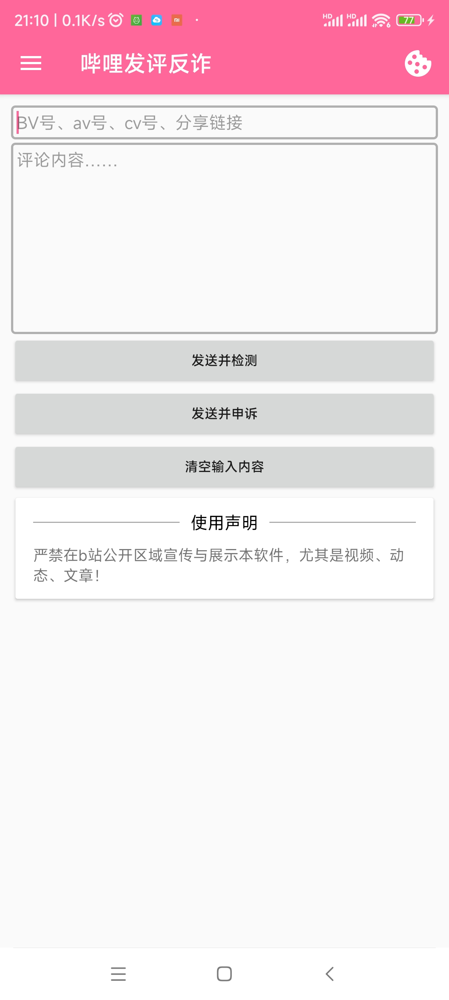 | 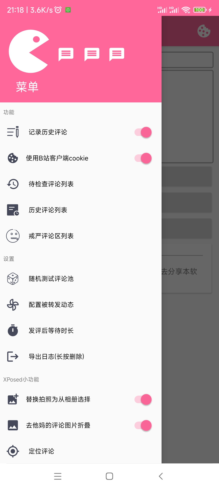 |

# 选项与设置

## 账号

对于评论的检查，需要获取对应UID对应账号cookie进行检查。需要在账号管理器中添加对应账号。

### 自动获取b站客户端cookie

自动获取哔哩哔哩客户端的cookie，检查时自动添加对应的账号到用户列表，无需手动添加账号。

cookie来源于webview中的cookies数据库，若该cookie无法使用可关闭该功能。

### 手动添加账号

右上角小饼干（旧版本的cookie设置），账号列表，添加账号。你可以在内置浏览器进行登录获取cookie，或者你通过别的方式获取到cookie（列如从Chrome抓取到的），填写完毕后完成以添加账号。

### 更新账号

若账号cookie失效，可在账号列表点击账号，获取新的cookie填写上去并更新

### 账号的评论区

填写自己发布内容的评论区地址，可以是你所发布的视频、动态、专栏，请勿填别人的。由检查评论是否只在当前评论区被Ban、扫描敏感词，这两个功能所使用

### 之前版本的小号

> 由于阿瓦隆的“查重黑名单”、“反刷屏”、账号风控……等机制，前面发送的评论可能会“污染了评论区”，导致检查评论区是否戒严时会把正常的评论区判定为戒严。此时可以用小号来检查，以避免主号发送评论所带来的影响，使评论区戒严检测的结果更精确（前提是你小号没被风控）。

检查评论区、扫描敏感词等功能所使用。6.0.0版本之后引入了多账号，旧概念已废除，现小号指的是非当前被检查评论所属发送者的账号。

## 随机评论列表

默认三首诗，建议自行修改以避免被针对。不建议设置“测试”、“加油UP”等，有时候戒严评论区都能直接过

### 随机生成测试评论

随机生成中文字符串，这些评论读起来几乎没有任何意义，因此能避免类似“加油UP”这样的白名单评论。

当然，因为它是随机的，就会有概率抽到敏感词，所以，生成了就发送到正常评论区来试，正常显示才保存使用。为啥做此功能？因为我发现列如“测试”这样的词语在某些戒严的评论区发送后可正常显示，造成检查结果不准确。鼓励UP主的更别说了，那几首诗特征也有点明显了。

## 被转发动态

敏感词扫描所使用，因为转发动态不用审核，可以快速获得一个干净评论区进行敏感词的扫描。强烈建议设置各种UP的抽奖动态。具体参见敏感词扫描

# 使用方法

### 手动发送检查

先输入BV号、cv号或者链接，支持bilibili\.com 标准链接和 b23\.tv 短链接。支持视频、专栏、动态类型的评论区。  

在评论输入框输入要发的评论，点击“发送并检测”，发出去会自动帮你检查一下，评论是否正常显示，或者被ShandowBan或者是系统秒删。如果被ban，你可以进一步操作，检查评论区将会去检查评论区是否戒严，如果没有戒严继续检查是否该评论仅在此评论区被ban；更多评论选项可以[扫描敏感词]、[申诉]、[删除发布的评论]……这里不多介绍。

如果你觉得输入表情之类的不方便，你可以在b站的评论输入框打好评论然后复制粘贴到这里。不过你在这里直接打方括号表情`[doge]`也无伤大雅。

### Xposed劫持APP评论发送

在Xposed模块里启用并勾选哔哩哔哩，在哔哩哔哩APP里评论发送成功后，会调起本发评反诈进行检查，方便快捷！支持对评论回复的检查！  
（图中评论区为戒严评论区）  
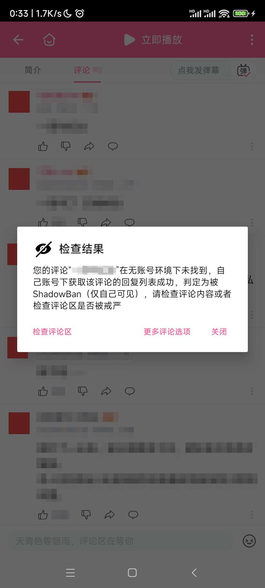

### 测试用例，若发现失效（指不被ShadowBan或删）请发issues

- 原批
- 依托答辩
- 文字狱

# 评论检查逻辑

## 检查逻辑

基本逻辑：ShadowBan评论带cookie可以在评论列表找到，不带cookie在评论列表找不到

哔哩哔哩还有一个获取评论回复列表的api，有以下特性

- 可以显示出根评论的内容等信息
- 游客获取shadowban评论的回复提示“已经被删除了”
- 登录了账号获取shadowban评论的回复正常
- 评论真的被系统秒删了，登录账号获取该评论的回复也提示“已经被删除了”
- up主发的评论被shadowban，游客也能正常获取该评论的回复列表  

根据以上特性，实现以下检查逻辑
保险起见，如果是根评论将使用无账号翻评论列表，使结果更准确。除回复评论由于时间正序的问题，仅使用定位评论参数seek_rpid

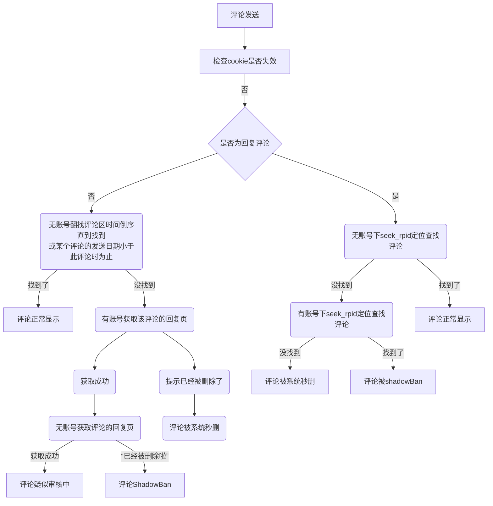

## 发送后的等待时间

为什么发送后要等待一段时间再检查（流程图中略）因为发布之后，系统需要一定的时间来处理评论，发送了立即获取评论列表导致获取到的最新评论没有该评论但是评论其实没有问题的，从而导致误判。当然你可以设置发送后要等待多久。设置成5秒（5000ms）最好，默认5秒，可在菜单中设置。  若评论包含图片，阿瓦隆需要更多时间去识别图片内容，所以要多加等待的时间以避免误判，可设置，默认15秒（15000ms）。

## 检查评论区

有些评论区有戒严机制，评论发送后默认屏蔽状态，经过一段时间后的人工或高级AI审核后才正常显示。检查逻辑如下，从设置的随机评论列表里抽取一个发送到评论区然后检查状态来判断评论区是否戒严。请注意，评论区戒严的检查结果**仅供参考**！阿瓦隆系统会针对账号控评，请使用更多的账号来检查以控制变量！

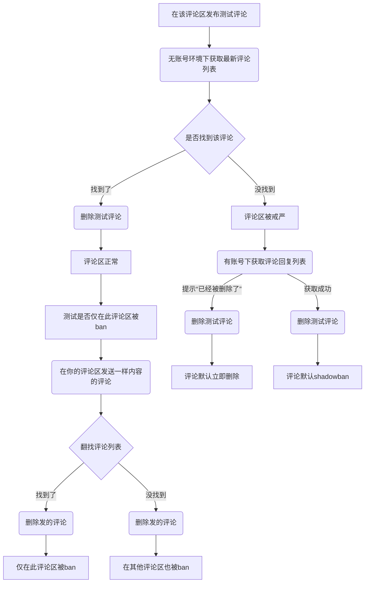

## 后台等待

等待时间过长时，你可能不愿意一直盯着这个dialog，直到它等待完成去检查评论。此时你可以点击“后台等待”按钮，它就会转至通知栏，下拉通知栏可以查看等待进度。等待完成后，点击通知可进行下一步的检查。  
**温馨提示**：如果你把通知划掉了，或者应用后台被杀，后续可以到待检查评论列表里选择评论进行检查。
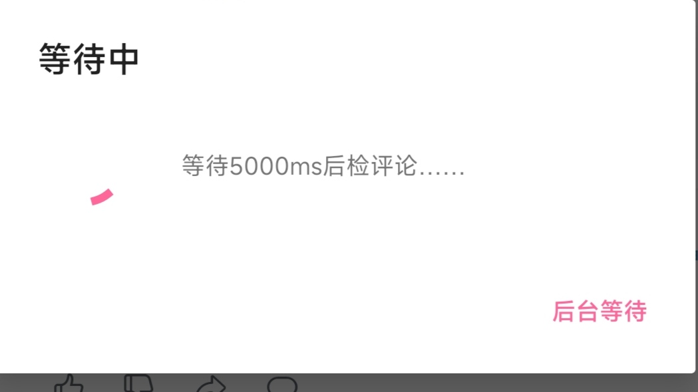
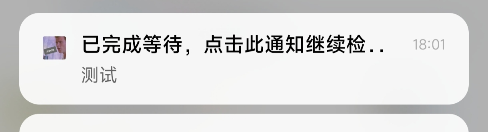

## 疑似审核与疑似正常评论

### 状态

疑似审核检出原理见检查逻辑，属于shadowban低级形式，也是无账号评论列表翻不到。

仅支持根评论检出疑似审核，回复评论没有相关特性能利用来检出。

建议申诉，大概率告诉你没有评论可申诉。当申诉返回无评论可申诉时，评论状态改为**疑似正常**

### 后台监控

使用方法：检查结果界面的『更多评论选项:监控评论』历史记录的『监控评论』，状态发生变化时通知你（需要通知权限，为确保通知能正常显示，建议“后台任务结果”的通知通道重要程度最高、给予悬浮通知权限、有条件可以设置震动与声音）

启动监控后，在通知栏进行后台任务，1分钟检查一次评论状态，直到评论状态发生变化，超时30分钟，如果超时30分钟后你还想继续进行监控，请到历史评论记录中选择刚才的评论进行监控。

### 与戒严评论区

自“疑似审核”的检查开发后，我发现，之前检出shadowban戒严的评论区，现在从新测试，发送评论检查结果为“疑似审核”。当然部分评论区还是shadowban，有些直接秒删。

# 统计

开启自动记录即可使用统计。搜集数据，汇总统计，有助于分析他ban什么评？喜欢戒严什么内容下的评论区？同时可作为你的记忆，记录你发了哪些评论。  
支持导出导入，点击右上角按钮即可。导出为zip或csv格式。

## 统计历史评论

打记录历史评论开关（默认打开），在调用检查后，检查结果将插入统计数据库。

### 评论8种状态

- 评论正常
- 仅自己可见
- 被系统秒删
- 包含敏感词
- 评论被隐身（invisible）
- 评论疑似审核
- 评论疑似正常（申诉时提示无可申诉评论时状态会切换为此）
- 未知状态（直接去申诉无法得知状态）

### DEMO（启用花里胡哨）

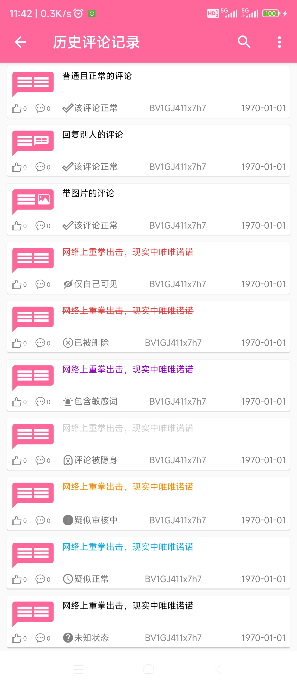

### 评论图片记录

若评论带图片，在评论检查时，会将图片缓存到`~/Android/data/icu.freedomIntrovert.biliSendCommAntifraud/files/pictures/`，同时评论记录记录的是图片源URL，若误删图片文件，还有一定的恢复能力（若b站图床不删除此图片）。历史评论导出格式为zip，其中包含图片文件。

若评论包含图片，打开评论详情对话框即可查看图片，图片预览界面长按图片可另存为。

### 点赞与回复统计

附加功能，在复查评论后更新，除了评论被删除不可更新，正常与ShadowBan等都会更新回复与点赞计数。

### 评论区id颜色示意

**意义为你是否检查过评论区，比如是否戒严与是否仅在此评论区被ban**

- 默认灰色：没有检查评论区

- 蓝色：只知道评论区没有戒严

- 绿色：评论区没有戒严且评论在其他评论区也被ban

- 红色：评论仅在此评论区被ban
  
  ### 被ban评论列表

5.0.0版本及之前存在被ban评论列表与历史评论列表，由于功能相似且存在同步问题，以及数据库统计不全（缺少评论parent、root等信息），被ban评论列表已被移除，此列表的评论将在版本更新后合并至历史评论列表。

**我只想看被ban的**

使用评论过滤功能，取消勾选“正常”即可筛选出所有被ban的。同YouTube发评反诈的设计。

同理，如果你只想看被shadowban的，那么你只用勾选“shadowBan"即可……

### 搜索评论

实现方式为`string.contians()`，搜索对象为评论和评论区源id（如BV号）。

支持时间范围搜索，语法示例：`[date]:2023.06.04-2023.10.24`，请注意不要漏掉前面的0

过滤与排序也一样应用于搜索结果，若你想搜索被ban的评论，那么先过滤被ban评论，然后进行搜索。

## 复查评论（更新评论状态）

如果评论被ban，还想关心后续的情况，比如你自前的申诉了，或者是等系统给你解禁。前提是你不要删除评论或评论已被删哦。在被ban评论列表里，点击被ban评论信息下的“复查状态”即可。要复制评论可以长按文字进行复制或点击“评论内容”复制全文。

对于正常的评论，也有可能出现后续被shdowBan或被删除的情况，甚至有传言说识别到了故意正常显示一段时间，然后一段时间后再shadowBan回去。有一位群友有真实的案例：评论发出后，甚至有很多的点赞与回复，一天后点赞停止，也没有人再回复了。检查之后发现评论还在，但是切小号就没有了，明显shadowBan了。所以添加评论记录让大家能再检查。

有一种特殊的状态我不知道该怎么称呼，暂且叫它“疑似审核中”，此状态下游客获取评论区获取不到此条评论，但是去申诉会提示“无可申诉评论”（大概率），此时再去检查发现游客通过评论的rpid拉取回复列表成功（可通过root属性获取根评论信息），只是列表里翻不到此条评论。这种情况可以过几个小时再来历史评论记录里检查。

如果评论发送出去正常，但是后期再检查时发现被shadowban了，状态会特此提醒：“**仅自己可见（秋后算账）**”。  

历史评论记录可记录评论的点赞与回复数（回复的评论没有回复数），在您更新评论状态后，此信息也会更新。

### 评论复查逻辑

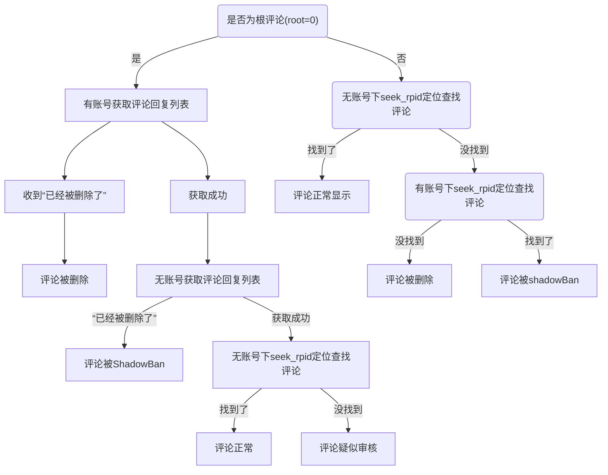

## 统计戒严评论区

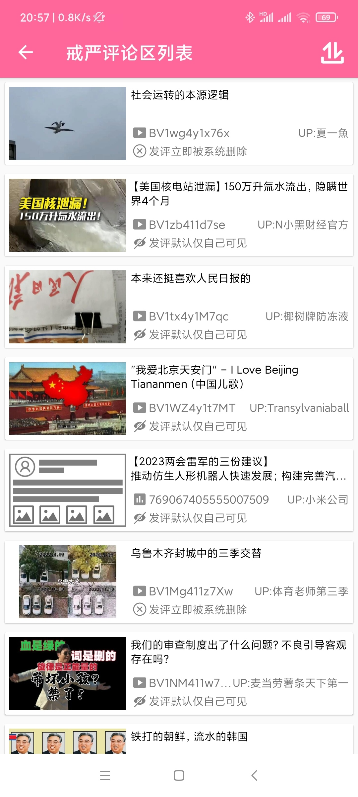  

## 定位评论

>  哔哩哔哩APP在私信、评论点赞的消息，点击可直接去评论区定位到目标评论。

利用此特性，历史记录里的评论就可以快捷定位了！查看谁回复了你什么的，一定程度上也可以用于反诈（没完全用，因为无cookie翻新发布第一页永远最保险。）

**由于观看视频Activity并不是Exported，所以需要启用XPosed才能使用评论定位功能**

### 历史评论定位

更多评论选项 ==> 定位评论

### 自定义定位评论

首页抽屉 ==> 定位评论

需填写评论区类型（type)，评论区oid，评论的rpid，可定位不是自己所发评论。

需要注意，视频、专栏、动态（type=17）无需指定源ID，因为视频oid=AV号，专栏oid=cv号，动态（type=17）oid=动态id，但是动态（type=11）特殊，评论区oid≠动态id，需要指定源id（动态id），否则只能查看评论不能查看所处动态（虽然动态APP不支持定位）

如果是回复别人的评论，需要填写root值（根评论rpid），否则无法定位到评论！

如何获取评论区某个评论的rpid？可以通过*举报*，打开所属评论的举报界面，**别真举报哈**！右上角三点，在浏览器打开，即可得到以下链接：

```
https://www.bilibili.com/h5/comment/report?mid=320773657&oid=80433022&pageType=1&rpid=3760801399
```

关键信息：

oid=80433022

pageType=1（评论区类型）

rpid=3760801399

这就是我们所要的信息，通过这些信息即可快捷定位评论。不过请注意，如果是回复别人的评论，需要获取根评论的rpid，所以得先获取根评论的rpid作为root！

# 扫描敏感词

## 原理与逻辑

在评论被ban后，在[更多评论选项]里选择[扫描敏感词]，即可开始扫描。请注意，扫描之前~~必须~~先设置账号评论区！

### 扫描方法如图，★为敏感词位置。

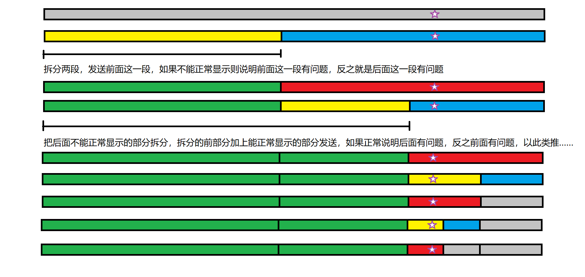
如上图扫描步骤，只到评论二分到设置的最小单位，停止扫描。敏感词就在红块内外。

### 计算查找次数

设扫描次数：x，评论长度：y，最小块大小：a

```math
$$
\begin{array}{c}
a\times 2^x=y
\\
2^x=\frac{y}{a}
\\
x=log_{2}{\frac{y}{a}}
\\
x=\frac{lg_{}{\frac{y}{a}}}{lg_{}{2}}
\end{array}
$$
```

### 疑问

- 红块就是敏感词所在域吗？不完全是。假设敏感词是“我是敏感词”，会出现：[<font color="#00dd00">我是敏</font>|<font color="#dd0000">感词</font>]的情况。因为发送“我是敏”没事，但是继续展开到“我是敏感词”才会出问题。红块没有完全盖住敏感词，有时候只是盖住了敏感词的一部分，也会导致敏感词不成立。

- 如果出现两个敏感词？展开法原本是从头开始一点一点展开到不能发送为止，如果有两个敏感词，只要展开到第一个敏感词处就不能正常显示了，二分展开法也是如此，所以只会扫出第一个敏感词，接着把敏感词改掉可以继续扫描下一个。

- 如果出现类似“唯唯诺诺，重拳出击”这样同时出现才会生效的敏感词？既然是同时出现才有效，那么直到扫描到它最后一个词语时才会异常，那么结果也是最后一个词语。当然这难以检测出具体是哪两个组合词，如果你把扫出来的词单独发送能正常显示，说明为组合词。如果你很想找出具体是哪两个组合词的话，我可以给你个方法，按以上二分法查找，在每次测试的评论末尾加上那个词语，就可以找出来，这我就不写到程序里了：）。
  
  ## 评论区选择

- 自己评论区

- 小号转发动态生成新的评论区，用完删除转发

- 当前评论区（不推荐，除非前两项都全文通过）

### 为什么要在自己的评论区扫描敏感词？

因为查重黑名单机制（详见阿瓦隆系统研究文档），这个机制可能会ban掉与你之前发布大致相同的评论（即使你删除了之前发的），因为相似而被ban的会直接影响到扫描结果，导致扫偏，甚至扫描过后，那段话都没法发了。不过，如果你是该评论区的up主，你将不会受到该机制的影响，所以扫描就在你所设置的评论区进行。当然，扫描敏感词要求的是全站通用的敏感词，仅在某评论区被ban的评论是没有扫描的价值的，故程序在扫描之前会检测是否评论区戒严以及是否仅在此评论区被ban。  

### 评论区问题

又是蜜汁阿瓦隆，相同文本的评论在不同评论区还会有不一样的待遇，摘自：[[敏感词分情况讨论](https://github.com/freedom-introvert/Research-on-Avalon-System-in-Bilibili-Comment-Area/blob/main/docs/%E6%B7%B1%E6%8C%96b%E7%AB%99%E5%A6%82%E4%BD%95%E6%8E%A7%E8%AF%84-%E5%AF%B9%E9%98%BF%E7%93%A6%E9%9A%86%E7%B3%BB%E7%BB%9F%E6%8E%A2%E7%A9%B6.md#%E6%95%8F%E6%84%9F%E8%AF%8D%E5%88%86%E6%83%85%E5%86%B5%E8%AE%A8%E8%AE%BA%E6%96%87%E6%A1%A3%E6%96%B0%E5%A2%9E%E4%BA%8E2024-03-06)]

- 敏感词分评论区讨论
  - 当在某评论区ShadowBan时
    - 其他非自己的评论区正常，自己评论区正常（这是被某评论区查重黑名单/反刷屏）
    - 其他非自己的评论区ShadowBan，自己评论区ShadowBan（全站ShadowBan）
    - 其他非自己的评论区ShadowBan，自己评论区正常（UP主特例）
  - 当你在两个未戒严的评论区发评论
    - 不一定键政的评论区，比如原神官号，“64GB内存”：shadowban/删除
    - 平平无常的视频评论区，“64GB内存”：正常

### 情况1解决方案

情况1使得把评论发到自己评论区进行扫描时会全文通过，但是非自己的评论区是有问题的

使用小号或让朋友发内容开一个评论区（~~请勿使用陌生人的，会被骂！~~），这样子去扫描敏感词才是正确的。但因为查重黑名单等各种反刷屏机制的存在，重复使用一个评论区会“变脏”

**使用小号创建一个动态，这样就可以低成本获得一个评论区**，不过动态内容填什么内容是不好选择的，运气差点还要等要审核。**转发动态就可以快速获得一个自己的动态评论区**，不用填内容，而且基不可能被等审核。被转发动态强烈推荐各种抽奖动态！！影响最小。扫描敏感词前，小号开个评论区，然后扫描评论就在此进行，扫描完评论就把那条转发动态给删了就OK。

**该功能已实现**。首先你得有个小号，先点击cookie设置，设置一个小号的cookie，若没有小号就不用往下看了。接着设置一个被转发的动态（强烈推荐抽奖动态），复制链接然后来主页填写即可，之后扫描敏感词就选择`使用小号转发动态生成新评论区（用完删除转发）`

### 情况2解决方案

直接在这个评论区进行扫描，但是你懂得，查重黑名单等反刷屏机制会影响最终的结果。

**该功能已实现**。扫描敏感词的评论区选择`当前评论区（不推荐，除非1,2选项全文通过且评论区未戒严）`

### 选项列表

**不准确因素**：指的是对扫描全站生效的敏感词所被影响的因素。在非自己评论区需要进行全文检查，以免评论只是在哪个评论区被Ban

| 选项                          | 全文检查 | 不准确因素            |
| --------------------------- | ---- | ---------------- |
| 自己评论区                       | 是    | UP主光环            |
| 小号转发动态生成新的评论区，用完删除转发        | 是    |                  |
| 当前评论区（不推荐，除非前两项全文通过且评论区未戒严） | 否    | 评论区作用域、AI分类标签作用域 |

当然，选当前评论区也不必是为了扫出全站生效的敏感词，也可以扫描当前评论区作用域下的敏感词！

# 发送后直接申诉（特殊玩法）

参见「[申诉评论](https://github.com/freedom-introvert/Research-on-Avalon-System-in-Bilibili-Comment-Area/blob/main/docs/%E6%B7%B1%E6%8C%96b%E7%AB%99%E5%A6%82%E4%BD%95%E6%8E%A7%E8%AF%84-%E5%AF%B9%E9%98%BF%E7%93%A6%E9%9A%86%E7%B3%BB%E7%BB%9F%E6%8E%A2%E7%A9%B6.md#%E7%94%B3%E8%AF%89%E8%AF%84%E8%AE%BA2022-12%E6%B7%BB%E5%8A%A0)」  

### 由来

如果发发的评论正常显示，然后去申诉会发生什么🤔  
答案是：该bv号或链接下无可申诉评论  
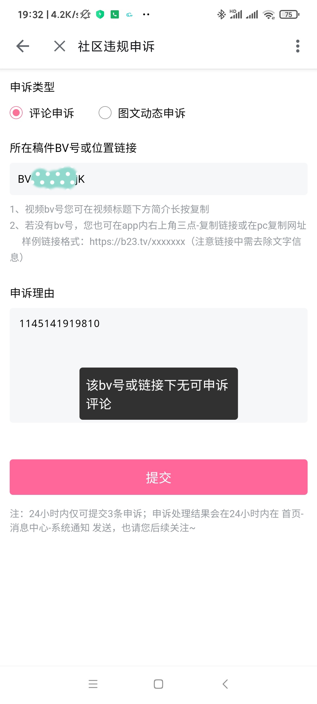

```json
{
  "code": 12082,
  "message": "该bv号或链接下无可申诉评论",
  "ttl": 1,
  "data": null
}
```

### 实现流程

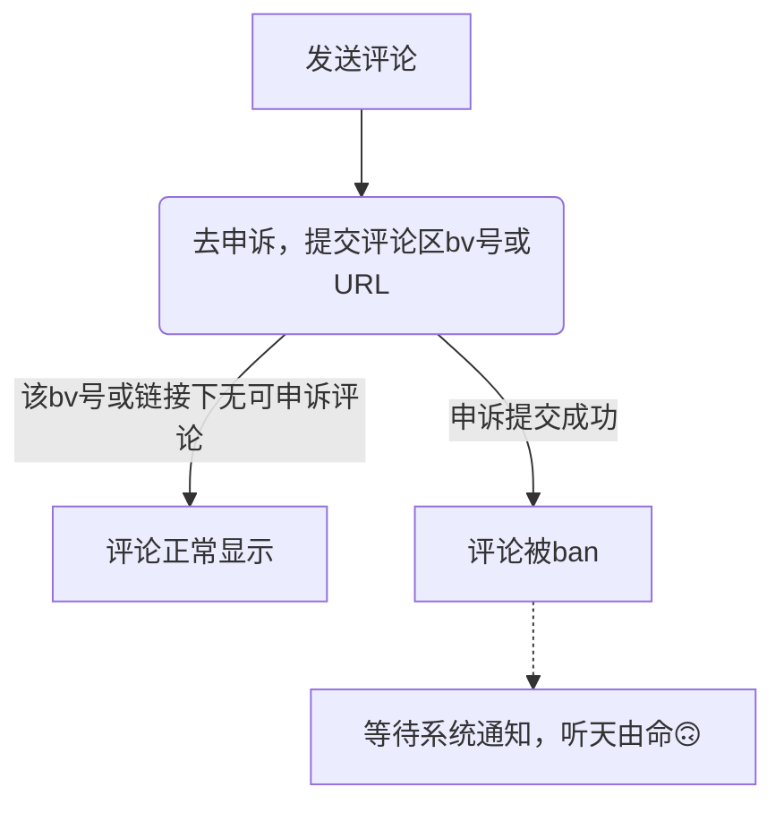

利用该方法，可以最精确的判断评论是否被ban。如果被ban了，然后就坐等系统通知（申诉成功or失败），非常方便。缺点也很大，每天只有三次的申诉机会，如果评论被ban，申诉提交成功就会使用一次，用完了就只能等明天了；无法得知评论具体状态，shadowban还是秒删？

### 缺陷

这么玩是可以更爽，但如果评论被ban，就不知道他是shadowban还是秒删，所以状态会被记录为“未知”（可在历史记录中更新）

## 关于申诉评论

在评论被ban后可在[更多评论选项]里去申诉该评论，与网页版申诉流程是一样的。  

发送申诉后，人机不会看你的申诉理由，你的申诉会先过一遍人机，如果人机对申诉不痛不痒才交给人工，真人才会去理解申诉理由。如果有多条评论，机器审核通过的会先恢复，然后才到人工审核的。  

人机申诉会通过你发的一系列被ban状态的评论，也就是如果你发了多条，他会全部恢复，无论评论是多久前发的。他不会看你的申诉理由，你在申述理由里填要指定恢复那条是没用的，除了人工会看。在shadowban评论上回复的任何评论都属于shadowban评论，一样会加入待申诉列表里。还有一个特性（bug？）是：你删除掉了shadowban评论，但是申诉过后依然会系统通知你“您的评论申诉已处理”，然后下面跟着你评论的略写，不过都是“无法恢复”，很少情况会恢复成功。  

评论不能正常显示时判断评论状态会发送测试回复评论、测试戒严的评论区会发送测试评论，请注意：申述后，这些自己已经删除的测试评论可能会被恢复，如果通知是“无法恢复”，那么不用管他，如果是“无违规”，请注意去删除测试评论！ 

# Xposed-显示隐身评论

突然发现评论有一个属性叫“invisible”，意为不可见的，如果为true，评论将不展示。这是前端的行为，下载到了评论，但是不展示罢了。  
本模块将把隐身评论显示出来，并将“[隐藏的评论]”注入在IP属地的后面作为提示（由于国际版没有IP属地，国际版可显示隐身评论但不标明）。 
 

# 浏览器油猴脚本

油猴安装脚本并启用

脚本将在你发送评论成功之后，弹出一个dialog，等待5秒后进行评论检查，检查后将展示检查结果。

当然，由于浏览器的原因，仅实现了最简单的检查功能，不提供历史评论记录等功能。

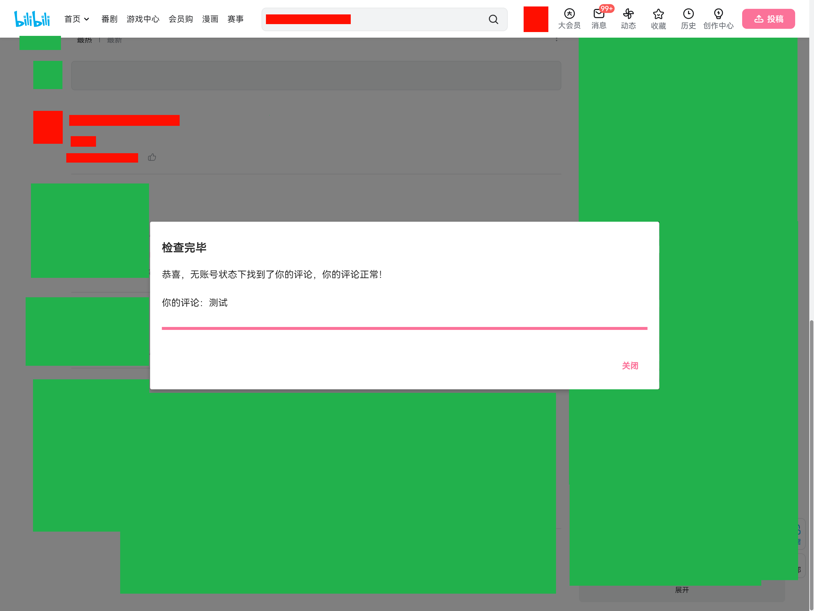

脚本：[哔哩发评反诈-油猴.js](./哔哩发评反诈-油猴.js)

# 第三方客户端Intent启动反诈

提供给第三方开源哔哩哔哩客户端开发者，仅需要将检查的结果以Intent Extras启动 `icu.freedomIntrovert.biliSendCommAntifraud/icu.freedomIntrovert.biliSendCommAntifraud.ByXposedLaunchedActivity`

即可调出弹窗进行检查

示例代码

```java
extras.putInt("action", 0);
extras.putLong("oid", oid);
extras.putInt("type", type);
extras.putLong("rpid", rpid);
extras.putLong("root", root));
extras.putLong("parent", parent));
extras.putString("comment_text", "测试");
……
intent.setComponent(new ComponentName("icu.freedomIntrovert.biliSendCommAntifraud",
        "icu.freedomIntrovert.biliSendCommAntifraud.ByXposedLaunchedActivity"));
intent.putExtras(extras);
activity.startActivity(intent);
```

### action参数

| action | 作用                          |
| ------ | --------------------------- |
| 0      | 检查评论                        |
| 1      | 检查弹幕（已废弃）                   |
| 2      | 重新检查评论，不插入待检查列表（本软件的后台等待功能） |
| 3      | 保存“评论包含敏感信息”的记录             |

### 检查评论参数

| 参数          | 类型           | 描述                                                         | 必须 |
| ------------- | -------------- | ------------------------------------------------------------ | ---- |
| oid           | long           | 评论区oid                                                    | 是   |
| type          | int            | 评论区type                                                   | 是   |
| rpid          | long           | rpid即评论ID                                                 | 是   |
| root          | long           | 根评论的rpid，如果你的评论不是回复，则为0                    | 是   |
| parent        | long           | 被回复的评论rpid，如果你的评论不是回复，则为0                | 是   |
| source_id     | String         | 评论区源ID，比如视频的BV号                                   | 是   |
| comment_text  | String         | 评论内容文本                                                 | 是   |
| pictures      | String (Json)  | 评论图片列表                                                 | 否   |
| ctime         | long           | 评论发送时间                                                 | 是   |
| uid           | long           | 发送者UID，用于检查cookie是否对应                            | 是   |
| toast_message | String         | "发送成功"之类的提示，旧版的功能，新版已移除，因为无意义     | 未用 |
| cookies       | List\<String\> | 账号cookie，本Hook端从webview目录获取（因为可能有多个所以list），可无。用于自动刷新对应账号cookie。用户设置不使用将被忽略 | 否   |

### source_id说明

| 评论区type | 评论区类型 | 取用            | 是否与oid一致 |
| ------- | ----- | ------------- | -------- |
| 1       | 视频    | BV号           | 否        |
| 12      | 专栏    | cv号（保留"cv"开头） | 是        |
| 11      | 动态    | 动态ID          | 否        |
| 17      | 动态    | 动态ID          | 是        |

# 关于

### 讨论交流

Telegram: [@biliSendCommAntifraud](https://t.me/+6Ugpd4TtB8liZDg1)

### LOGO含义

来自：Never Gonna Give You Up - Rick Astley  
意为“发送成功”但是你被骗了🤪

### icon使用

部分来源于[iconfont-阿里巴巴矢量图标库](https://www.iconfont.cn/)

### 使用守则

严禁在b站公开区域宣传与展示本软件，特别是以视频、动态、文章来宣传！

同时建议也不要在过于知名的外网键政社区X（Twitter）上宣传，哪里晶哥浓度较高😨

**默许隐晦的在评论区中分享给需要的人 ，但不要报上软件大名**，如“哔哩发评反诈”、“反诈”，可引导到LSP仓库查找哔哩哔哩的评论检查插件。当然，最好的方式是私信发给人家。特别注意，如果你分享软件的这条评论被ban，请立即删除，更不要申诉自爆！适用场合：某人说自己评论被吞了、别人看不到等。


### 用户耻辱柱

UID：398650682

公开在个人动态中宣传哔哩发评反诈，并且被官方关进小黑屋。

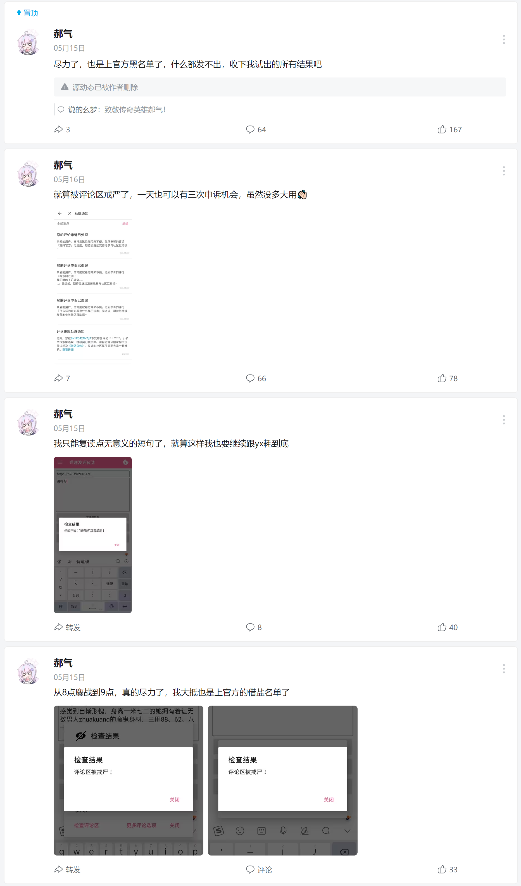

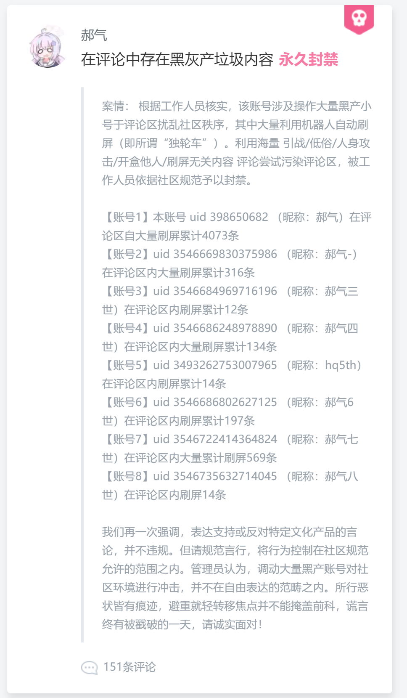
