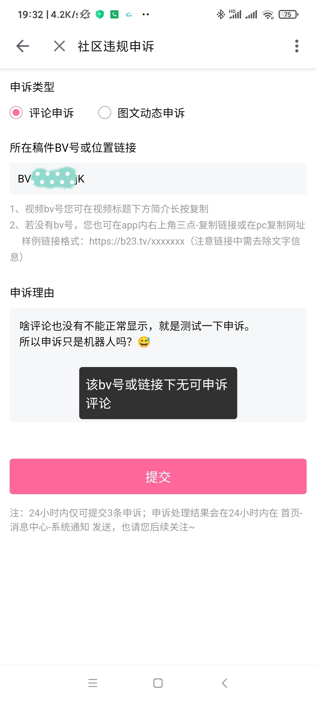

# 功能介绍
使用软件之前，如果你不了解阿瓦隆系统，请先阅读这篇文档：[深挖b站如何控评-对阿瓦隆系统探究](https://github.com/freedom-introvert/Research-on-Avalon-System-in-Bilibili-Comment-Area)  
## 软件截图


|  |    |
| ---------------------------------------------------------- | ------------------------------------------------------------ |
|  |  |


## 登录
点击右上角“cookie”图标，可以直接填写cookie（列如从Chrome抓取到的），也可以直接使用内置网页浏览器进行登录。在浏览器登录你的b站账号，会抓取到cookie，设置并返回以完成cookie设置。  


### 小号的cookie

由于阿瓦隆的“查重黑名单”、“反刷屏”、账号风控……等机制，前面发送的评论可能会“污染了评论区”，导致检查评论区是否戒严时会把正常的评论区判定为戒严。

此时可以用小号来检查，以避免主号发送评论所带来的影响，使评论区戒严检测的结果更精确（前提是你小号没被风控）。

### 使用方法（手动发送）

配置随机测试评论池，将会随机抽取一个用于评论被ban时回复该评论测试评论状态以及评论区是否戒严。同一个评论区抽取到的测试的评论不会重复。一行一个，最少4个，如果你没配置默认为古诗3首。  

先输入BV号、cv号或者链接，支持bilibili\.com 标准链接和 b23\.tv 短链接。支持视频、专栏、动态类型的评论区。  

在评论输入框输入要发的评论，点击“发送并检测”，发出去会自动帮你检查一下，评论是否正常显示，或者被ShandowBan或者是系统秒删。如果被ban，你可以进一步操作，检查评论区将会去检查评论区是否戒严，如果没有戒严继续检查是否该评论仅在此评论区被ban；更多评论选项可以[扫描敏感词]、[申诉]、[删除发布的评论]这里不多介绍  。

如果你觉得输入表情之类的不方便，你可以在b站的评论输入框打好评论然后复制粘贴到这里。不过你在这里直接打“[doge]”也无伤大雅。
## Xposed功能
在Xposed模块里启用并勾选哔哩哔哩，在哔哩哔哩APP里评论发送成功后，会调起本发评反诈进行检查，方便快捷！  
Xposed支持对评论回复的检查！  
（图中评论区为戒严评论区）  


### 注意事项
- 哔哩发评反诈必须登录账号（设置cookie），而且登录的账号要与哔哩哔哩APP里登录的一致！不然一定会出现异想天开的问题🤣
- 请允许哔哩哔哩打开“哔哩发评反诈”！由于context问题，Xposed hook到的context，是哔哩哔哩的，统计只能插入哔哩哔哩APP的数据库，所以我使用了透明activity显示在哔哩哔哩之上，当评论发送成功时启动本应用的这个透明activity并传入参数，这样就可以使用自己的context，将统计数据插入自己的数据库。
# 评论检查逻辑
## 发送并检查评论(因产生垃圾评论已弃用)

### 发送后的等待时间
为什么发送后要等待一段时间再检查（流程图中略）因为发布之后，系统需要一定的时间来处理评论，发送了立即获取评论列表导致获取到的最新评论没有该评论但是评论其实没有问题的，从而导致误判。当然你可以设置发送后要等待多久。设置成5秒（5000ms）最好，默认5秒，可在菜单中设置。  若评论包含图片，阿瓦隆需要更多时间去识别图片内容，所以要多加等待的时间以避免误判，可设置，默认15秒（15000ms）。
### 新检查方法   
哔哩哔哩还有一个获取评论回复列表的api，有以下特性
- 可以显示出根评论的内容等信息
- 游客获取shadowban评论的回复提示“已经被删除了”
- 登录了账号获取shadowban评论的回复正常
- 评论真的被系统秒删了，登录账号获取该评论的回复也提示“已经被删除了”
- up主发的评论被shadowban，游客也能正常获取该评论的回复列表  

根据此特性我改进了检查程序，不对评论发送回复就可以检测状态，减少测试评论的发送，可以减少这些测试评论对申诉所造成影响！2.2.0版本已更新该方法。


## 检查评论区

## 后台等待

等待时间过长时，你可能不愿意一直盯着这个dialog，直到它等待完成去检查评论。此时你可以点击“后台等待”按钮，它就会转至通知栏，下拉通知栏可以查看等待进度。等待完成后，点击通知可进行下一步的检查。  
警告：如果你把通知划掉了，将丢失待检查评论，历史评论记录也不会记录你的评论！


# 统计
开启自动记录即可使用统计。搜集数据，汇总统计，有助于分析他ban什么评？喜欢戒严什么内容下的评论区？以及回忆你发了哪些评论。  
支持导出导入，点击右上角按钮即可。导出为zip或csv格式。

## 统计历史评论  
打记录历史评论开关（默认打开），在调用检查后，检查结果将插入统计数据库。

### 评论7种状态

- 评论正常
- 仅自己可见
- 被系统秒删
- 包含敏感词
- 评论被隐身（invisible）
- 评论疑似正常（申诉时提示无可申诉评论时状态会切换为此）
- 未知状态（直接去申诉无法得知状态）

### DEMO（启用花里胡哨）


### 评论图片记录

若评论带图片，在评论检查时，会将图片缓存到`~/Android/data/icu.freedomIntrovert.biliSendCommAntifraud/files/pictures/`，同时评论记录记录的是图片源URL，若误删图片文件，还有一定的恢复能力（若b站图床不删除此图片）。历史评论导出格式为zip，其中包含图片文件。

若评论包含图片，打开评论详情对话框即可查看图片，图片预览界面长按图片可另存为。

### 点赞与回复统计

附加功能，在复查评论后更新，除了评论被删除不可更新，正常与ShadowBan等都会更新回复与点赞计数。

### 评论区id颜色示意

**意义为你是否检查过评论区，比如是否戒严与是否仅在此评论区被ban**

- 灰色：没有检测戒严之类的
- 蓝色：只知道评论区没有戒严
- 绿色：评论区没有戒严且评论在其他评论区也被ban
- 红色：评论仅在此评论区被ban
### 被ban评论列表

5.0.0版本及之前存在被ban评论列表与历史评论列表，由于功能相似且存在同步问题，以及数据库统计不全（缺少评论parent、root等信息），被ban评论列表已被移除，此列表的评论将在版本更新后合并至历史评论列表。

**我只想看被ban的**

使用评论过滤功能，取消勾选“正常”即可筛选出所有被ban的。同YouTube发评反诈的设计。

同理，如果你只想看被shadowban的，那么你只用勾选“shadowBan"即可……

### 搜索评论

实现方式为`string.contians()`，搜索对象为评论和评论区源id（如BV号）。

支持时间范围搜索，语法示例：`[date]:2023.06.04-2023.10.24`，请注意不要漏掉前面的0

过滤与排序也一样应用于搜索结果，若你想搜索被ban的评论，那么先过滤被ban评论，然后进行搜索。

## 复查评论（更新评论状态）

如果评论被ban，还想关心后续的情况，比如你自前的申诉了，或者是等系统给你解禁。前提是你不要删除评论或评论已被删哦。在被ban评论列表里，点击被ban评论信息下的“复查状态”即可。要复制评论可以长按文字进行复制或点击“评论内容”复制全文。

对于正常的评论，也有可能出现后续被shdowBan或被删除的情况，甚至有传言说识别到了故意正常显示一段时间，然后一段时间后再shadowBan回去。有一位群友有真实的案例：评论发出后，甚至有很多的点赞与回复，一天后点赞停止，也没有人再回复了。检查之后发现评论还在，但是切小号就没有了，明显shadowBan了。所以添加评论记录让大家能再检查。

有一种特殊的状态我不知道该怎么称呼，暂且叫它“疑似审核中”，此状态下游客获取评论区获取不到此条评论，但是去申诉会提示“无可申诉评论”（大概率），此时再去检查发现游客通过评论的rpid拉取回复列表成功（可通过root属性获取根评论信息），只是列表里翻不到此条评论。这种情况可以过几个小时再来历史评论记录里检查。

如果评论发送出去正常，但是后期再检查时发现被shadowban了，状态会特此提醒：“**仅自己可见（秋后算账）**”。  

历史评论记录可记录评论的点赞与回复数（回复的评论没有回复数），在您更新评论状态后，此信息也会更新。
### 评论复查逻辑

## 快捷编辑重发

在历史评论记录里，长按评论item，即可编辑重发，重发后不影响你原来的评论。不支持发送图片（即使你的评论以前有图片）。如果你要编辑的评论是回复评论，后面发送的评论也是某评论的回复评论


## 统计戒严评论区

  


# 扫描敏感词

## 原理与逻辑

在评论被ban后，在[更多评论选项]里选择[扫描敏感词]，即可开始扫描。请注意，扫描之前必须先设置你的评论区！
### 扫描方法如图，★为敏感词位置。

如上图扫描步骤，只到评论二分到设置的最小单位，停止扫描。敏感词就在红块内外。

### 计算查找次数


设扫描次数：x，评论长度：y，最小块大小：a

``` math
$$
\begin{array}{c}
a\times 2^x=y
\\
2^x=\frac{y}{a}
\\
x=log_{2}{\frac{y}{a}}
\\
x=\frac{lg_{}{\frac{y}{a}}}{lg_{}{2}}
\end{array}
$$
```


### 疑问
- 红块就是敏感词所在域吗？不完全是。假设敏感词是“我是敏感词”，会出现：[<font color="#00dd00">我是敏</font>|<font color="#dd0000">感词</font>]的情况。因为发送“我是敏”没事，但是继续展开到“我是敏感词”才会出问题。红块没有完全盖住敏感词，有时候只是盖住了敏感词的一部分，也会导致敏感词不成立。
- 如果出现两个敏感词？展开法原本是从头开始一点一点展开到不能发送为止，如果有两个敏感词，只要展开到第一个敏感词处就不能正常显示了，二分展开法也是如此，所以只会扫出第一个敏感词，接着把敏感词改掉可以继续扫描下一个。
- 如果出现类似“唯唯诺诺，重拳出击”这样同时出现才会生效的敏感词？既然是同时出现才有效，那么直到扫描到它最后一个词语时才会异常，那么结果也是最后一个词语。当然这难以检测出具体是哪两个组合词，如果你把扫出来的词单独发送能正常显示，说明为组合词。如果你很想找出具体是哪两个组合词的话，我可以给你个方法，按以上二分法查找，在每次测试的评论末尾加上那个词语，就可以找出来，这我就不写到程序里了：）。
### 为什么要在自己的评论区扫描敏感词？
因为查重黑名单机制（详见阿瓦隆系统研究文档），这个机制可能会ban掉与你之前发布大致相同的评论（即使你删除了之前发的），因为相似而被ban的会直接影响到扫描结果，导致扫偏，甚至扫描过后，那段话都没法发了。不过，如果你是该评论区的up主，你将不会受到该机制的影响，所以扫描就在你所设置的评论区进行。当然，扫描敏感词要求的是全站通用的敏感词，仅在某评论区被ban的评论是没有扫描的价值的，故程序在扫描之前会检测是否评论区戒严以及是否仅在此评论区被ban。  

你的评论区可以设置视频和动态还有专栏，尽量的选择一些很无聊没有人看的（观看数<500）。你可以随便发一条很无聊的游戏录像或者是你瞎发条动态都行，只要够无聊到没有人观看。
### 其他评价
突然发现某些游戏（网易我的世界除外）算仁慈了😂，“文本文本敏感词文本”，变“文本文本***文本”，至少你可以知道敏感词是啥。

## 评论区问题

又是蜜汁阿瓦隆，相同文本的评论在不同评论区还会有不一样的待遇，摘自：[[敏感词分情况讨论](https://github.com/freedom-introvert/Research-on-Avalon-System-in-Bilibili-Comment-Area/blob/main/docs/%E6%B7%B1%E6%8C%96b%E7%AB%99%E5%A6%82%E4%BD%95%E6%8E%A7%E8%AF%84-%E5%AF%B9%E9%98%BF%E7%93%A6%E9%9A%86%E7%B3%BB%E7%BB%9F%E6%8E%A2%E7%A9%B6.md#%E6%95%8F%E6%84%9F%E8%AF%8D%E5%88%86%E6%83%85%E5%86%B5%E8%AE%A8%E8%AE%BA%E6%96%87%E6%A1%A3%E6%96%B0%E5%A2%9E%E4%BA%8E2024-03-06)]
- 敏感词分评论区讨论
   - 当在某评论区ShadowBan时
     - 其他非自己的评论区正常，自己评论区正常（这是被某评论区查重黑名单/反刷屏）
     - 其他非自己的评论区ShadowBan，自己评论区ShadowBan（全站ShadowBan）
     - 其他非自己的评论区ShadowBan，自己评论区正常（UP主特例）
   - 当你在两个未戒严的评论区发评论
     - 不一定键政的评论区，比如原神官号，“64GB内存”：shadowban/删除
     - 平平无常的视频评论区，“64GB内存”：正常


### 情况1解决方案

情况1使得把评论发到自己评论区进行扫描时会全文通过，但是非自己的评论区是有问题的

使用小号或让朋友发内容开一个评论区（~~请勿使用陌生人的，会被骂！~~），这样子去扫描敏感词才是正确的。但因为查重黑名单等各种反刷屏机制的存在，重复使用一个评论区会“变脏”

**使用小号创建一个动态，这样就可以低成本获得一个评论区**，不过动态内容填什么内容是不好选择的，运气差点还要等要审核。**转发动态就可以快速获得一个自己的动态评论区**，不用填内容，而且基不可能被等审核。被转发动态强烈推荐各种抽奖动态！！影响最小。扫描敏感词前，小号开个评论区，然后扫描评论就在此进行，扫描完评论就把那条转发动态给删了就OK。

**该功能已实现**。首先你得有个小号，先点击cookie设置，设置一个小号的cookie，若没有小号就不用往下看了。接着设置一个被转发的动态（强烈推荐抽奖动态），复制链接然后来主页填写即可，之后扫描敏感词就选择`使用小号转发动态生成新评论区（用完删除转发）`


### 情况2解决方案

直接在这个评论区进行扫描，但是你懂得，查重黑名单等反刷屏机制会影响最终的结果。

**该功能已实现**。扫描敏感词的评论区选择`当前评论区（不推荐，除非1,2选项全文通过且评论区未戒严）`

# 发送后直接申诉（特殊玩法）
参见「[申诉评论](https://github.com/freedom-introvert/Research-on-Avalon-System-in-Bilibili-Comment-Area/blob/main/docs/%E6%B7%B1%E6%8C%96b%E7%AB%99%E5%A6%82%E4%BD%95%E6%8E%A7%E8%AF%84-%E5%AF%B9%E9%98%BF%E7%93%A6%E9%9A%86%E7%B3%BB%E7%BB%9F%E6%8E%A2%E7%A9%B6.md#%E7%94%B3%E8%AF%89%E8%AF%84%E8%AE%BA2022-12%E6%B7%BB%E5%8A%A0)」  
### 由来
如果发发的评论正常显示，然后去申诉会发生什么🤔  
答案是：该bv号或链接下无可申诉评论  


``` json
{
  "code": 12082,
  "message": "该bv号或链接下无可申诉评论",
  "ttl": 1,
  "data": null
}
```
### 实现流程


利用该方法，可以最精确的判断评论是否被ban。如果被ban了，然后就坐等系统通知（申诉成功or失败），非常方便。缺点也很大，每天只有三次的申诉机会，如果评论被ban，申诉提交成功就会使用一次，用完了就只能等明天了；无法得知评论具体状态，shadowban还是秒删？

### 缺陷

这么玩是可以更爽，但如果评论被ban，就不知道他是shadowban还是秒删，所以状态会被统计为“未知”

## 关于申诉评论
在评论被ban后可在[更多评论选项]里去申诉该评论，与网页版申诉流程是一样的。  

发送申诉后，人机不会看你的申诉理由，你的申诉会先过一遍人机，如果人机对申诉不痛不痒才交给人工，真人才会去理解申诉理由。如果有多条评论，机器审核通过的会先恢复，然后才到人工审核的。  

人机申诉会通过你发的一系列被ban状态的评论，也就是如果你发了多条，他会全部恢复，无论评论是多久前发的。他不会看你的申诉理由，你在申述理由里填要指定恢复那条是没用的，除了人工会看。在shadowban评论上回复的任何评论都属于shadowban评论，一样会加入待申诉列表里。还有一个特性（bug？）是：你删除掉了shadowban评论，但是申诉过后依然会系统通知你“您的评论申诉已处理”，然后下面跟着你评论的略写，不过都是“无法恢复”，很少情况会恢复成功。  

评论不能正常显示时判断评论状态会发送测试回复评论、测试戒严的评论区会发送测试评论，请注意：申述后，这些自己已经删除的测试评论可能会被恢复，如果通知是“无法恢复”，那么不用管他，如果是“无违规”，请注意去删除测试评论！ 
# Xposed-显示隐身评论
突然发现评论有一个属性叫“invisible”，意为不可见的，如果为true，评论将不展示。这是前端的行为，下载到了评论，但是不展示罢了。  
本模块将把隐身评论显示出来，并将“[隐藏的评论]”注入在IP属地的后面作为提示（由于国际版没有IP属地，国际版可显示隐身评论但不标明）。 
 
# 浏览器油猴脚本
有很多人想要浏览器的脚本，但是我不怎么会前端，我用ChatGPT简单生成了一个脚本并自己修改了下。拦截发送评论请求并获取评论ID进行检查。  

仅简简单单实现了检查功能，并使用alert()显示结果。没有检查评论区、申诉、扫描敏感词等功能，有意者可以帮我实现完整版脚本并发issues告知。  
脚本：[哔哩发评反诈-油猴.js](./哔哩发评反诈-油猴.js)

# 关于
### 讨论交流
Telegram: [@biliSendCommAntifraud](https://t.me/biliSendCommAntifraud)
### LOGO含义
来自：Never Gonna Give You Up - Rick Astley  
意为“发送成功”但是你被骗了🤪

### icon使用
部分来源于[iconfont-阿里巴巴矢量图标库](https://www.iconfont.cn/)